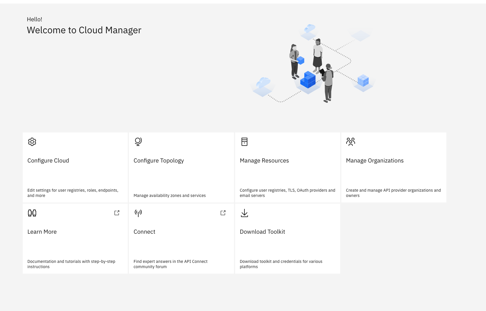

###Prerequisites

* Openshift cluster with Openshift pipelines operator installed.
https://github.com/openshift/tektoncd-pipeline-operator 
* API Connect CPI 

The CLI and credentials for the CLI can be downloaded from API/Cloud Manager UI by clicking `Download Toolkit`



###Setup Instructions:

1. Create a admin user that can login to cloud manager

    1. Login to the cloud Manager
    
    2. Click 'members'
    
    3. Add member
    
    4. se these credentials to login to the CLI

    ```bash
    # Set environment variables
    server=$(oc get routes --selector=app.kubernetes.io/name=cloud-admin-endpoint  -o custom-columns=ROUTE:.spec.host --no-headers)
    username=<USERNAME>
    password=<USERNAME>

    # Login
    ./apic login --username $username --password $password --server $server --realm admin/default-idp-1
    ```

2. Create a secret that contains the api manager credentials

    ```bash
    oc create secret generic apic-api-manager-credentials \ --from-literal=client_id=pipeline \ --from-literal=client_secret=pipelinesecret \ --type=Opaque
    ```

3. Obtain a client id:

    1. Create the following json (example) and save as apic-pipeline.json. This provides the parameters for registering an app named apic-pipeline using the toolkit client type and a pre-defined client ID and secret :
    ```json
    {
      "name": "apic-pipeline",
      "client_id": "pipeline", 
      "client_secret": "pipelinesecret",
      "client_type": "toolkit"
    }
    ```

    2. Command to register the above apic-pipeline app
    ```bash
    apic registrations:create --server $server apic-pipeline.json
    ```

4. In the api connect namespace create a secret that contains the client id and secret

    Note: make sure you edit the below with your client id and secret
    ```bash
    oc create secret generic apic-restapi-client-secret \ --from-literal=client_id=pipeline \ --from-literal=client_secret=pipelinesecret \ --type=Opaque
    ```

5.  Create a secret that contains the api manager credentials

    ```bash
    oc create secret generic apic-api-manager-credentials \ --from-literal=client_id=pipeline \ --from-literal=client_secret=pipelinesecret \ --type=Opaque
    ```

#### Useful commands:

* Get admin realms

    ```bash
    # Set environment variables
    server=$(oc get routes --selector=app.kubernetes.io/name=cloud-admin-endpoint  -o custom-columns=ROUTE:.spec.host --no-headers)

    # Login
    apic identity-providers:list --scope admin --server $server
    ```

* Get provider realms

    ```bash
    # Set environment variables
    server=$(oc get routes --selector=app.kubernetes.io/name=api-manager-endpoint -o custom-columns=ROUTE:.spec.host --no-headers)

    # Login
    apic identity-providers:list --scope provider --server $server
    ```
